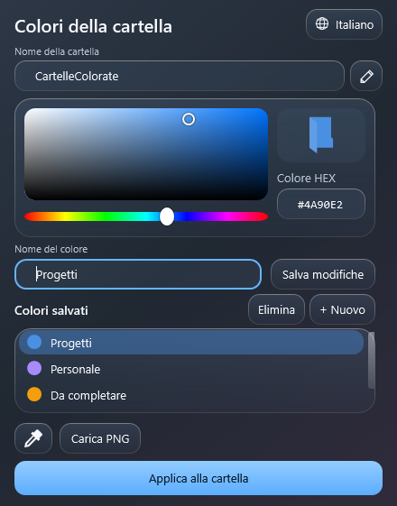

# CartelleColorate

Colori personalizzati e icone PNG per le cartelle di Windows 11, dal menu del tasto destro.

**Gratuito · Open source · Senza account nell'app · Funzionamento locale**

## Scaricare e installare

Scarica [CartelleColorate per Windows — 0.4.0-beta.1](downloads/CartelleColorate-0.4.0-beta.1-windows.zip?raw=true). Il pacchetto pronto contiene tutto il necessario; **Code → Download ZIP** scarica invece il progetto sorgente. Il [checksum SHA-256](downloads/SHA256SUMS.txt) permette di verificare il pacchetto.

1. Estrai tutto lo ZIP in una cartella normale.
2. Chiudi eventuali finestre di CartelleColorate ed esegui **Installa.cmd**.
3. Su una cartella: **tasto destro → Mostra altre opzioni → Cambia colore**.
4. Al primo avvio scegli la lingua e premi **Continua**. La scelta viene salvata.
5. Seleziona un colore salvato oppure apri **Personalizza colori…**.

L'installazione riguarda l'utente corrente e normalmente non richiede privilegi amministrativi. Il terminale compare durante installazione/rimozione; il normale utilizzo avviene con avvio nascosto.

## Lingue

Italiano, English, 简体中文, Español, हिन्दी, العربية, Português, বাংলা, Русский, Français, Deutsch, 日本語, 한국어, Bahasa Indonesia e اردو.

La schermata iniziale propone la lingua di Windows, se supportata, oppure l’inglese. Il pulsante con il globo cambia la lingua in qualsiasi momento, aggiornando anche il menu del tasto destro. Arabo e urdu hanno disposizione da destra a sinistra; colori, codici HEX e nomi personali vengono conservati. Le traduzioni sono incluse nel pacchetto e funzionano senza Internet.

## Funzioni

- Nome della cartella modificabile nella stessa finestra; la matita rinomina senza cambiare icona, mentre Applica conferma nome e colore o PNG.
- Selezione precisa dal riquadro sfumato, dalla barra della tonalità o tramite codice HEX.
- Piccolo mirino nel riquadro; frecce per regolare e Maiusc + frecce per movimenti più fini.
- Colori con nomi personalizzati, modificabili e salvabili senza un limite imposto dall'app.
- Sottomenu con colori salvati e icone colorate.
- Pipetta desktop con lente 10×, pixel centrale evidenziato e codice HEX; Esc annulla.
- Importazione PNG come icona, con proporzioni e trasparenza conservate.
- Finestra compatta 456 × 600, superfici arrotondate e riflessi leggeri, con tema chiaro/scuro del sistema.
- Vetro traslucido con sfocatura nativa del desktop su Windows 11 22H2 o successivo; sfondo opaco se la trasparenza è disabilitata o non disponibile.
- Ripristino della configurazione originale della cartella.
- Processo in background per i colori del menu, che termina dopo 20 minuti di inattività.

## Requisiti e stato della release

**Versione 0.4.0-beta.1: prima anteprima pubblica.** Test automatici effettuati nell'ambiente di sviluppo; installazione su PC diversi, uso dello zoom su più monitor e comportamento visivo di Esplora file richiedono ancora verifiche manuali.

Richiede Windows 11 con Windows PowerShell 5.1, .NET Framework/WPF, Windows Script Host e componente VBScript funzionanti. PC aziendali o installazioni dove questi componenti sono disabilitati possono impedirne l'uso. Non è un'app MSIX né un'app firmata digitalmente. Non richiede programmi aggiuntivi se i componenti indicati sono già presenti.

L'installer genera le due librerie native dai sorgenti sul PC: corregge il blocco delle DLL scaricate da Internet senza modificare le protezioni di Windows. Se l'app non parte, compare un messaggio e i dettagli vengono salvati in `avvio-errore.log` nella cartella dell'app.

## Dati, ripristino e rimozione

I dati restano in `%LOCALAPPDATA%\CartelleColorate`: palette `colori.json`, lingua in `impostazioni.json`, icone e backup. Non vengono usati servizi Internet, telemetria o account nell'app. La pipetta legge una piccola area del desktop soltanto quando attiva; non salva screenshot su disco.

La rinomina dall’app aggiorna i backup della cartella e delle sue sottocartelle. Prima di spostare o rinominare una cartella fuori dall’app, ripristina l’icona: i backup sono associati al percorso. Il ripristino recupera il `desktop.ini` originario e può sostituire successive personalizzazioni di altre applicazioni.

Per rimuovere il menu esegui **Rimuovi-menu.cmd**. Palette, icone e backup vengono conservati: eliminare questi dati può far perdere le icone personalizzate e la possibilità di ripristino. La rimozione non ripristina automaticamente tutte le cartelle.

## Limiti conosciuti

- La voce si trova nel menu **Mostra altre opzioni**, non nel menu compatto nativo di Windows 11.
- Le icone restano nel profilo locale e non vengono trasferite automaticamente ad altri PC o utenti.
- Sono supportate cartelle reali scrivibili, una per volta; non raccolte virtuali o modifiche ricorsive.
- Il primo comando dopo l'arresto del processo richiede un nuovo avvio. Il ridisegno finale delle icone dipende da Esplora file.
- Usa una finestra del selettore alla volta per modificare la palette.
- La pipetta può non leggere desktop protetti o contenuti esclusi dalla cattura.
- Gli script usano `ExecutionPolicy Bypass` soltanto nel processo di avvio, senza modificare permanentemente la policy. Le restrizioni aziendali possono restare attive.

Se Windows o l'antivirus bloccano il pacchetto, non disattivare le protezioni. Verifica la provenienza del download, consulta il sorgente e segnala il messaggio ricevuto.

## Compilare e contribuire

Vedi [BUILD.md](BUILD.md) per creare il pacchetto dai sorgenti e [TESTING.md](TESTING.md) per le verifiche. Segnala problemi nella sezione **Issues**, indicando versione Windows, versione dell'app e passaggi per riprodurre il problema, senza allegare dati personali.

Distribuito sotto [licenza MIT](LICENSE). Non è un prodotto Microsoft.
