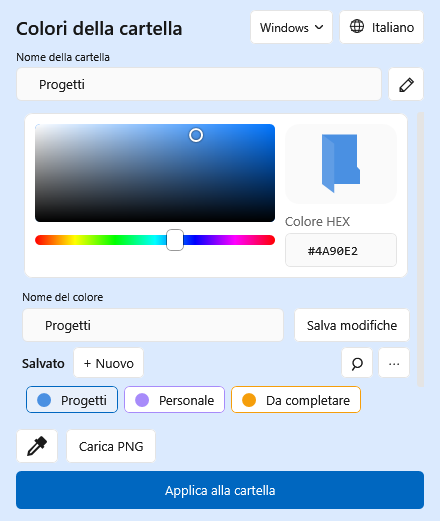
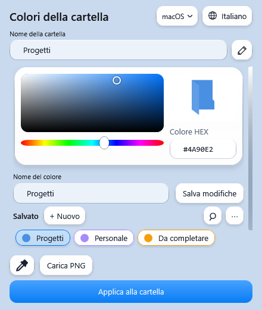

# CartelleColorate

Colori personalizzati e icone PNG per le cartelle di Windows 11, dal menu del tasto destro.

**Gratuito · Open source · Senza account nell'app · Funzionamento locale**

## Scaricare e installare

Scarica [CartelleColorate 1.1 per Windows](https://github.com/yn7wvz64hj-oss/CartelleColorate/releases/download/v1.1.0/CartelleColorate-1.1.0-windows.zip). La [pagina della release ufficiale](https://github.com/yn7wvz64hj-oss/CartelleColorate/releases/tag/v1.1.0) contiene note e allegati. È disponibile anche il [download dal repository](downloads/CartelleColorate-1.1.0-windows.zip?raw=true). Il pacchetto pronto contiene tutto il necessario; **Code → Download ZIP** scarica invece il progetto sorgente. Il [checksum SHA-256](downloads/SHA256SUMS.txt) permette di verificare il pacchetto.

1. Estrai tutto lo ZIP in una cartella normale.
2. Chiudi eventuali finestre di CartelleColorate ed esegui **Installa.cmd**.
3. Su una cartella: **tasto destro → Mostra altre opzioni → Cambia colore**.
4. Al primo avvio scegli la lingua e premi **Continua**. La scelta viene salvata.
5. Seleziona un colore salvato oppure apri **Personalizza colori…**.

L'installazione riguarda l'utente corrente e normalmente non richiede privilegi amministrativi. Il terminale compare durante installazione/rimozione; il normale utilizzo avviene con avvio nascosto.

## Lingue

Italiano, English, 简体中文, Español, हिन्दी, العربية, Português, বাংলা, Русский, Français, Deutsch, 日本語, 한국어, Bahasa Indonesia e اردو.

La schermata iniziale propone la lingua di Windows, se supportata, oppure l’inglese. Il pulsante con il globo cambia la lingua in qualsiasi momento, aggiornando anche il menu del tasto destro. Arabo e urdu hanno disposizione da destra a sinistra; colori, codici HEX e nomi personali vengono conservati. Le traduzioni sono incluse nel pacchetto e funzionano senza Internet.

## Funzioni

- **⋯ → Sfondo**: scegli un colore uniforme con tabella grafica e HEX, oppure un’immagine PNG, JPEG o BMP. Ogni stile conserva il proprio sfondo; le immagini vengono copiate nei dati dell’app e incluse nei backup.
- Menu dell’app e selettori con angoli arrotondati, caratteri Segoe UI, evidenziazioni discrete e colori coerenti con il tema, ispirati a Windows 11.

- Trascina un PNG sull’anteprima (o nella finestra) per personalizzare l’icona; la cartella selezionata resta la stessa. Le cartelle trascinate continuano a cambiare la selezione, anche in gruppo.
- Cerca i preset completi per nome o codice HEX; i preferiti sono in cima.
- Anteprime dei preset progressive e memorizzate, caricamento dei PNG in background e anteprime ridotte senza modificare il file originale.

- Backup della libreria in un unico file `.ccbackup`: colori, raccolte, preset con PNG, preferiti, recenti e preferenze. L’importazione conserva i dati esistenti, gestisce i nomi duplicati e non applica icone alle cartelle del nuovo PC.
- Preset preferiti nel menu del tasto destro, in una tendina con anteprime. Dal menu ⋯ → Preset completi, seleziona un preset e premi **Tasto destro ★**; premi ancora per rimuoverlo.
- **Ripeti** dal menu ⋯ riapplica una modifica annullata, anche di nome o su più cartelle, verificando che le cartelle non siano cambiate nel frattempo.

- Preset completi con colore, PNG e simbolo: salva, carica, rinomina o elimina dal menu ⋯. Il PNG viene copiato nei dati dell’app.
- Trascina una o più cartelle reali nella finestra per selezionarle insieme, anche da percorsi diversi.
- Cronologia delle modifiche riuscite, con annullamento di una voce specifica e protezione dalle modifiche successive.
- Gestione delle cartelle personalizzate con anteprima, percorso, apertura e ripristino dell’icona originale.
- Simboli stella, spunta, lucchetto, cuore, documento, musica e foto, con colore HEX indipendente.
- Anteprima dell’icona a 16, 32, 48 e 96 pixel, anche per PNG e contrassegni.
- Aspetto e vetro: opacità, intensità del rilievo e tema di sistema, chiaro o scuro; le modifiche sono visibili prima del salvataggio.
- Controllo aggiornamenti in background: l’icona di download accanto allo stile compare solo quando esiste una versione più recente. Il controllo automatico si può disattivare nelle impostazioni dell’aspetto.

- Nome della cartella modificabile nella stessa finestra; la matita rinomina senza cambiare icona, mentre Applica conferma nome e colore o PNG.
- Selezione precisa dal riquadro sfumato, dalla barra della tonalità o tramite codice HEX.
- Piccolo mirino nel riquadro; frecce per regolare e Maiusc + frecce per movimenti più fini.
- Ricerca apribile dalla lente, filtri per raccolta e otto colori recenti.
- Menu ⋯: selezione di più cartelle, editor PNG con zoom/posizione/ritaglio e contrassegni stella, spunta e lucchetto.
- Cambio multiplo con annullamento dell’intero gruppo e rollback automatico in caso di errore.
- Conferme discrete e breve animazione di selezione, rispettando le animazioni del sistema.
- Nuvole affiancate: tasto destro per modificare, rinominare, eliminare e segnare un preferito.
- Preferiti in cima; trascina le nuvole per riordinarle nel proprio gruppo. Nel menu sono disponibili anche Sposta prima/dopo.
- Menu ⋯ della raccolta per importare/esportare JSON. L’importazione aggiunge i colori senza duplicare quelli con lo stesso nome e codice.
- Annulla ultima modifica recupera nome e icona precedenti, anche dopo la riapertura. Il pulsante compare sulla cartella dell’ultima modifica.
- Colori con nomi personalizzati, modificabili e salvabili senza un limite imposto dall'app.
- Sottomenu con colori salvati e icone colorate.
- Pipetta desktop con lente 10×, pixel centrale evidenziato e codice HEX; Esc annulla.
- Importazione PNG come icona, con proporzioni e trasparenza conservate.
- Finestra compatta 456 × 560, superfici arrotondate e riflessi leggeri, con tema chiaro/scuro del sistema.
- Pulsante dello stile in alto: scegli Windows classico oppure macOS con superfici in vetro rialzate. La scelta è salvata e il passaggio conserva nome, colore e PNG selezionati.
- Vetro traslucido con sfocatura nativa del desktop su Windows 11 22H2 o successivo; sfondo opaco se la trasparenza è disabilitata o non disponibile.
- Ripristino della configurazione originale della cartella.
- Processo in background per i colori del menu, che termina dopo 20 minuti di inattività.

## Due stili

Il pulsante in alto apre la scelta Windows/macOS. La sfocatura del desktop appare durante l’uso quando disponibile; queste anteprime mostrano la disposizione e le superfici.

| Windows classico | Vetro macOS |
| --- | --- |
|  |  |

## Requisiti e stato della release

**Versione 1.1: release ufficiale con sfondi personalizzabili e menu moderni.** Verifiche automatiche nelle 15 lingue, avvio nascosto, integrazione del menu Windows, gestione delle immagini, annullamento, ripetizione e backup. Il comportamento di Esplora file e dell’effetto vetro dipende anche dalle impostazioni del PC.

Richiede Windows 11 con Windows PowerShell 5.1, .NET Framework/WPF, Windows Script Host e componente VBScript funzionanti. PC aziendali o installazioni dove questi componenti sono disabilitati possono impedirne l'uso. Non è un'app MSIX né un'app firmata digitalmente. Non richiede programmi aggiuntivi se i componenti indicati sono già presenti.

L'installer genera le due librerie native dai sorgenti sul PC: corregge il blocco delle DLL scaricate da Internet senza modificare le protezioni di Windows. Se l'app non parte, compare un messaggio e i dettagli vengono salvati in `avvio-errore.log` nella cartella dell'app.

## Dati, ripristino e rimozione

I dati restano in `%LOCALAPPDATA%\CartelleColorate`: palette `colori.json`, lingua in `impostazioni.json`, icone e backup. Non vengono usati account o telemetria. Solo il controllo aggiornamenti contatta GitHub per leggere VERSION: il controllo all’apertura è attivo per impostazione predefinita e si può disattivare da ⋯ → Aspetto e vetro. Il download si apre nel browser su richiesta. Le altre funzioni restano locali. La pipetta legge una piccola area del desktop soltanto quando attiva; non salva screenshot su disco.

La rinomina dall’app aggiorna i backup della cartella e delle sue sottocartelle. Prima di spostare o rinominare una cartella fuori dall’app, ripristina l’icona: i backup sono associati al percorso. Il ripristino recupera il `desktop.ini` originario e può sostituire successive personalizzazioni di altre applicazioni.

Per rimuovere il menu esegui **Rimuovi-menu.cmd**. Palette, icone e backup vengono conservati: eliminare questi dati può far perdere le icone personalizzate e la possibilità di ripristino. La rimozione non ripristina automaticamente tutte le cartelle.

## Limiti conosciuti

- La voce si trova nel menu **Mostra altre opzioni**, non nel menu compatto nativo di Windows 11.
- Le icone restano nel profilo locale e non vengono trasferite automaticamente ad altri PC o utenti.
- Sono supportate cartelle reali scrivibili; il menu di Esplora file apre una cartella, mentre il pulsante ⋯ permette di scegliere un gruppo. Non sono supportate raccolte virtuali o modifiche ricorsive.
- Il primo comando dopo l'arresto del processo richiede un nuovo avvio. Il ridisegno finale delle icone dipende da Esplora file.
- Usa una finestra del selettore alla volta per modificare la palette.
- La pipetta può non leggere desktop protetti o contenuti esclusi dalla cattura.
- Gli script usano `ExecutionPolicy Bypass` soltanto nel processo di avvio, senza modificare permanentemente la policy. Le restrizioni aziendali possono restare attive.

Se Windows o l'antivirus bloccano il pacchetto, non disattivare le protezioni. Verifica la provenienza del download, consulta il sorgente e segnala il messaggio ricevuto.

## Compilare e contribuire

Vedi [BUILD.md](BUILD.md) per creare il pacchetto dai sorgenti e [TESTING.md](TESTING.md) per le verifiche. Segnala problemi nella sezione **Issues**, indicando versione Windows, versione dell'app e passaggi per riprodurre il problema, senza allegare dati personali.

Distribuito sotto [licenza MIT](LICENSE). Non è un prodotto Microsoft.
